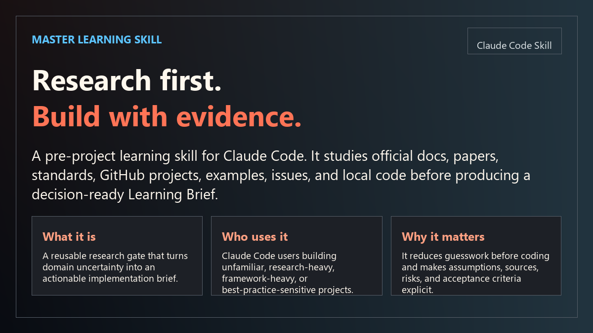
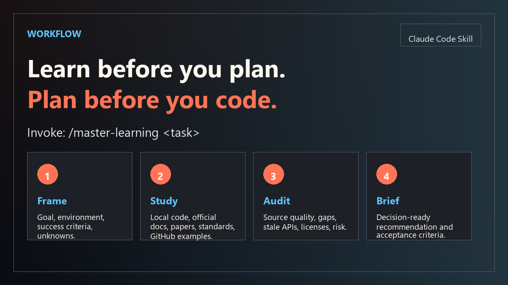
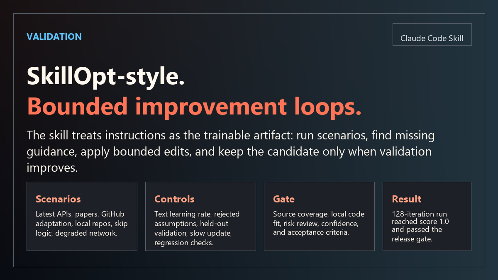
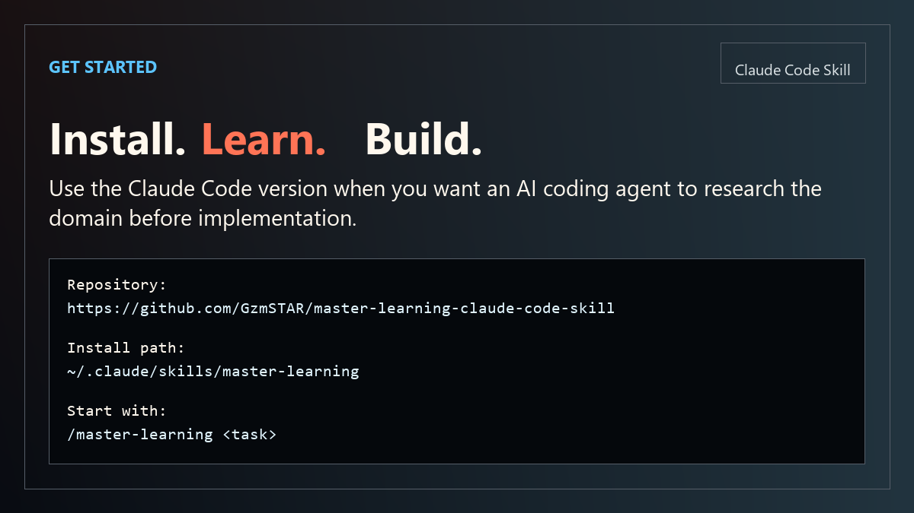

# Master Learning for Claude Code



`master-learning` is a Claude Code skill for pre-project domain learning. It runs a separate learning pass before implementation, then returns a decision-ready `Learning Brief` to the main Claude Code session.

The core idea is simple: a master keeps the mind of an apprentice. Before building, learn the field.

This Claude Code version uses:

```yaml
context: fork
agent: general-purpose
```

That means the research pass runs in a forked context, keeping exploration separate from the main implementation conversation.

## The Problem It Solves

AI coding agents are fast, but unfamiliar domains often punish speed. If an agent starts coding before reading current docs, paper assumptions, GitHub examples, local project conventions, and known failure modes, the result can be technically plausible but wrong.

`master-learning` adds a repeatable research gate before implementation. It turns vague uncertainty into a source-backed `Learning Brief`, so Claude Code can plan and build from evidence instead of stale memory or guesses.

## What This Skill Does

Many coding agents can write code quickly, but they often fail when the task requires learning first. A new framework, a paper-backed method, a GitHub ecosystem, a changing API, or a project with strong local conventions can make direct implementation risky.

Use `/master-learning <task>` to make Claude Code:

- Inspect local project files, dependency manifests, configs, tests, and existing conventions.
- Study official documentation, release notes, migration notes, standards, and specifications.
- Read papers and translate methods, assumptions, and evaluation setup into engineering constraints.
- Review GitHub repositories beyond stars: license, activity, examples, tests, issues, dependency health, and reuse risk.
- Mark weak evidence, stale APIs, source conflicts, abandoned repositories, missing licenses, and provisional conclusions.
- Return a concise `Learning Brief` for the main session.



## When To Use

Use this skill when you are:

- Starting a project in an unfamiliar technical or research domain.
- Choosing a framework, library, algorithm, paper method, or architecture.
- Asking Claude Code to follow latest docs, best practices, standards, or GitHub examples.
- Adapting a GitHub project into your own project.
- Working on a task where a wrong assumption would waste implementation time.
- Modifying a local project where existing conventions should be read before editing.

Do not use it for trivial edits, typo fixes, formatting-only work, or direct bug fixes with clear local evidence.

## What The Learning Brief Includes

The brief is designed for real engineering work, not for decorative research:

- `Task`: user goal, target environment, success criteria, research depth, and confidence.
- `Sources`: URLs or paths, source type, date or currency, reliability, and purpose.
- `Domain Model`: key concepts, objects, data, relationships, and vocabulary.
- `Local Code Lessons`: repository structure, conventions, configs, tests, and constraints.
- `GitHub/Code Lessons`: reviewed repositories, patterns, license and reuse notes, examples, and issues.
- `Paper/Standard Lessons`: methods, assumptions, evaluation setup, requirements, and limits.
- `Implementation Patterns`: architecture, API contracts, data flow, control flow, and test strategy.
- `Risks and Anti-Patterns`: weak assumptions, edge cases, stale docs, source conflicts, and things to avoid.
- `Recommendation`: proposed approach, acceptance criteria, and next steps.
- `Open Questions`: unresolved decisions or missing evidence.



## SkillOpt-Style Optimization

This repository includes a Microsoft SkillOpt-inspired local optimization workflow. It does not fine-tune a model. Instead, it treats `SKILL.md` as the trainable artifact, applies bounded text edits, and accepts a candidate only after validation.

Included artifacts:

- `.claude/skills/master-learning/references/skillopt-training.md`
- `.claude/skills/master-learning/scripts/skillopt_train.py`
- `.claude/skills/master-learning/training/benchmark-scenarios.json`
- `.claude/skills/master-learning/training/skillopt-run-2026-06-21.md`
- `.claude/skills/master-learning/training/skillopt-run-2026-06-21-round2.md`
- `.claude/skills/master-learning/training/skillopt-run-2026-06-21-128.md`

Scenario coverage:

- Latest framework and API tasks
- Paper reproduction tasks
- GitHub adaptation tasks
- Local-project-first tasks
- Low-risk skip behavior
- Network-degraded research

The 128-iteration stability run reached `score 1.0` and passed the release gate.



## Install

### Personal Install

Windows PowerShell:

```powershell
git clone https://github.com/GzmSTAR/master-learning-claude-code-skill.git
Copy-Item -Recurse -Force .\master-learning-claude-code-skill\.claude\skills\master-learning "$env:USERPROFILE\.claude\skills\master-learning"
```

macOS / Linux:

```bash
git clone https://github.com/GzmSTAR/master-learning-claude-code-skill.git
mkdir -p ~/.claude/skills
cp -R master-learning-claude-code-skill/.claude/skills/master-learning ~/.claude/skills/master-learning
```

### Project Install

Windows PowerShell:

```powershell
git clone https://github.com/GzmSTAR/master-learning-claude-code-skill.git
Copy-Item -Recurse -Force .\master-learning-claude-code-skill\.claude\skills\master-learning .\.claude\skills\master-learning
```

macOS / Linux:

```bash
git clone https://github.com/GzmSTAR/master-learning-claude-code-skill.git
mkdir -p .claude/skills
cp -R master-learning-claude-code-skill/.claude/skills/master-learning .claude/skills/master-learning
```

Restart Claude Code if the skill list does not refresh automatically.

### Quick Check

```bash
ls ~/.claude/skills/master-learning
```

## Usage

```text
/master-learning Build a robot vision prototype. Study official docs, GitHub examples, papers, and local project constraints before planning.
```

```text
/master-learning Learn the current best implementation pattern for this new framework and produce a Learning Brief before coding.
```

## Repository Structure

```text
.claude/
  skills/
    master-learning/
      SKILL.md
      references/
      scripts/
      training/
```

The helper scripts use only the Python standard library.

## Related Version

Codex version:
https://github.com/GzmSTAR/master-learning-skill

## License

MIT
